# Your Shopping List
*Your Shopping List* is the place to go if you want a quick and easy way to create a shopping list while also have the abilty to keep track of what you already bought, and share that list someone.

This is a project created during the Code Institute flag, being the portfolio project 4. It is for learning purposes only.

Link to live site
Picture of responsiveness

## Contents

* [User Experience](#user-experience)
    * [Colour Scheme](#colour-scheme)
    * [Font](#Font)
* [Project Planning](#project-planning)
    * [Agile Methods](#agile-methods)
    * [MoSCoW method](moscow-method)
    * [User Stories](#user-stories)
    * [Wireframes](#wireframes)
    * [ERDs](#erds)
* [Features](#features)
    * [CRUD functionality](#crud-functionality)
    * [Showcase](#showcase)
    * [Future Features](#future-features)
* [Technologies and Languages used](#technologies-and-languages-used)
    * [Languages](#Languages)
    * [Technologies](#technologies)
    * [Frameworks and libraries](#frameworks-and-languages)
    * [Tools](#tools)
* [Testing](#testing)
* [Deployment](#deployment)
    * [Guthub](#github)
    * [Django](#Django)
    * [Heroku](#heroku)
    * [CI Database](#CI-database)
    * [Clone](#Clone)
    * [Fork](#fork)
* [Credits](#credits)
    * [Code](#code)
    * [Acknowledgements](#acknowledgements)

## User Experience
This application needs to be fast to use. It is competing with your phones notes app, a piece of paper and a pen and of course just your memory.

The USP of this site is to have a clean look which gives the user a clear oversite and easy to use features you can not find at it's competitors.
### Colour Scheme
### Font
## Project Planning
This project is intended to help with the everyday life mission to go to the grocery store. With a working shopping list system you can make your shopping more efficient and be sure to come back home with the items you needed. With a sharing feature a partner, friend or family member can do the shopping the site user planned and in that way be of service in sickness and in health.

**Site Goals**
* Provide a quick way to write and handle shopping lists
* Have a nice look with good responsiveness
* Have easy to use features, especially on mobile
* Have a quick and secure way of sharing lists

### Agile Methods
This project was planned with agile methods. As some features depended on others to be built, the obvious way was to start with the most fundamental features and user stories first and work upwards. Since one feature had the label "Could have" it was planned to be built last, after the site was fully functioning.

### MoSCoW Method
The issues created for this site were labeled with the use of the MoSCoW method. That divides the labels into:

* Must have - features that is a must for the site to be working as intended
* Should have - features that the site should have to be of use to the user
* Could have - features that could bring that little extra to the user
* Won't have - features that no longer fit the project or won't be included in this release

### User Stories
|User Story|Priority|
|-|-|
|As a user I can create an account so that I can sign in to the application.|MUST HAVE|
|As a user I can log in to my account so that I can see, edit and delete my lists|MUST HAVE|
|As a user I can log out of my account so that me or someone else can log in to another account on the same device|MUST HAVE|
|As a user I can create a shopping list so that I have a place to write what groceries to buy.|SHOULD HAVE|
|As a user I can edit a list I created before so that I can reuse older lists or change a list I intended to use.|SHOULD HAVE|
|As a user I can delete a list so that I don’t have to see it in my list menu|SHOULD HAVE|
|As a user I can share a list so that other people can shop from a list I have created.|COULD HAVE|
|As an admin I can delete users so that inactive users don’t take up space in the database|SHOULD HAVE|

### Wireframes
The site was developed mobile first. The desktop wireframes are therefor bigger versions of the mobile wireframes.

**Mobile**

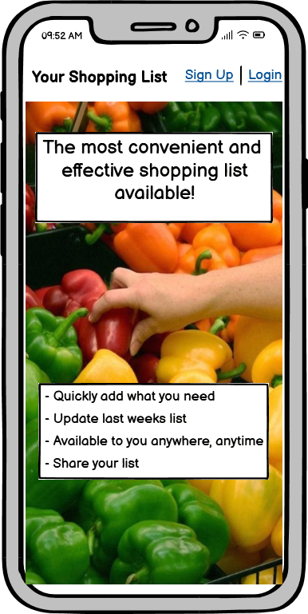
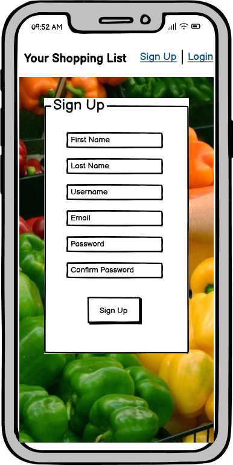
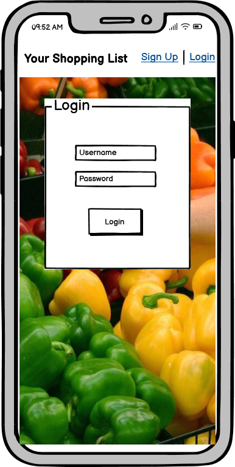
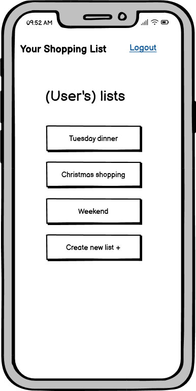
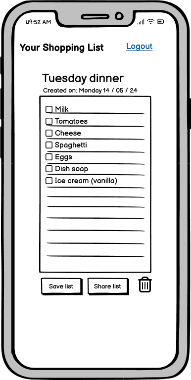
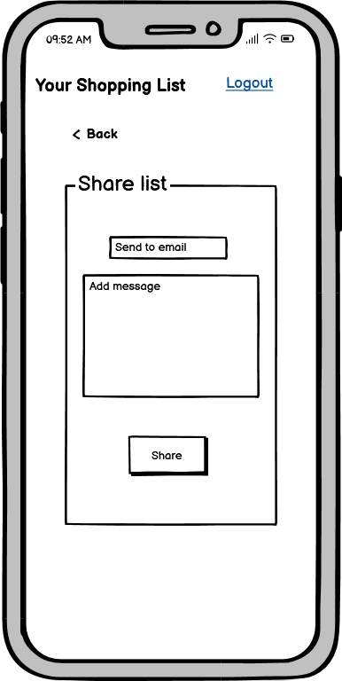

**Desktop**

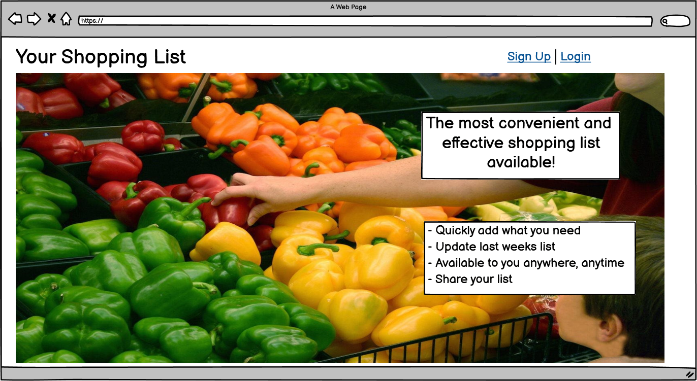
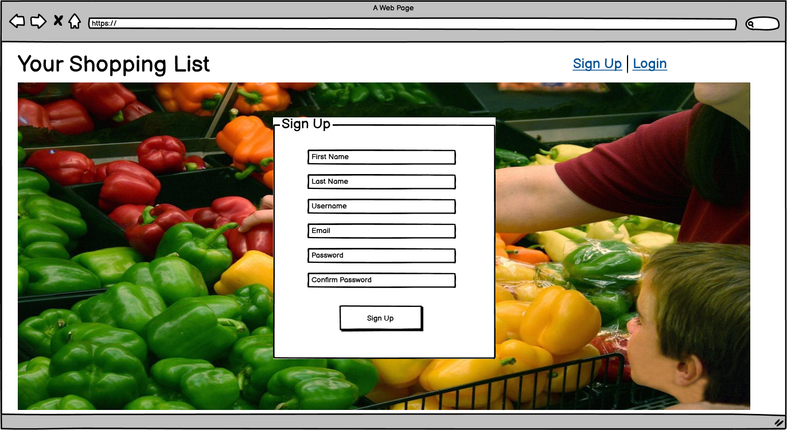
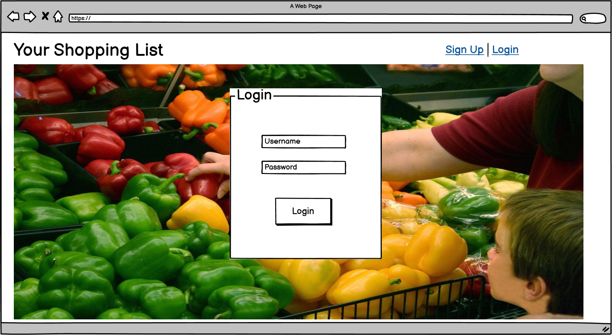

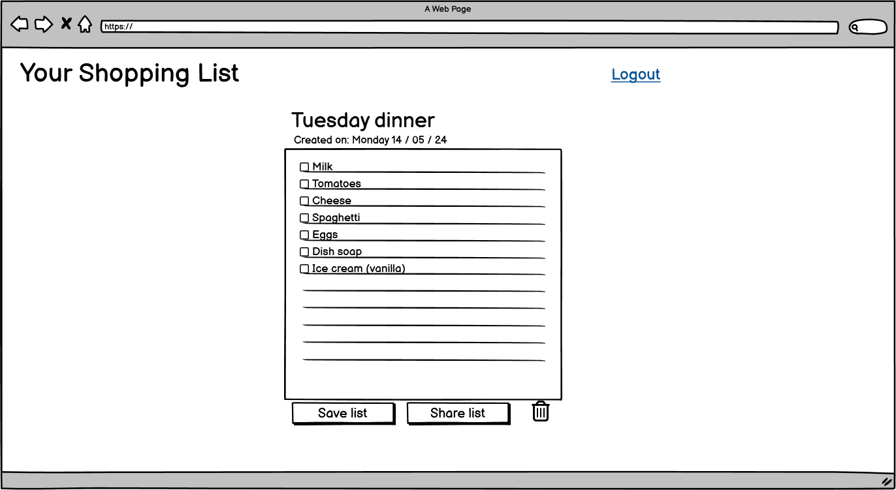
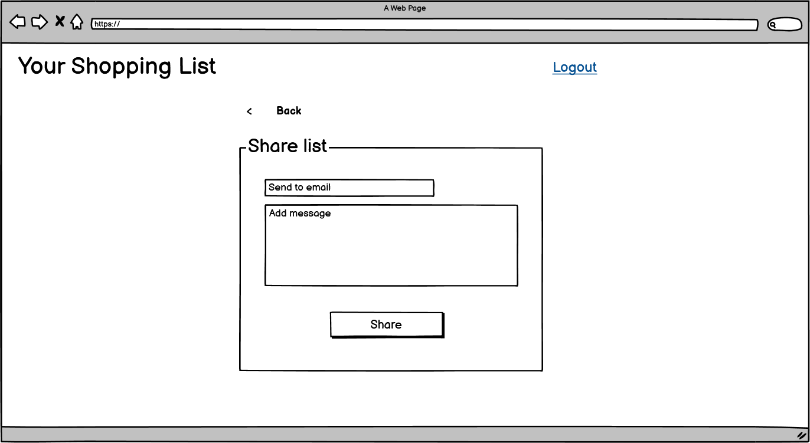

## Credits
The log in/log out/sign up code is from the CI Blog Walkthrough
The toast js is from Bootstrap
the notebook look is from https://www.codesdope.com/blog/article/getting-notebook-paper-effect-with-css/