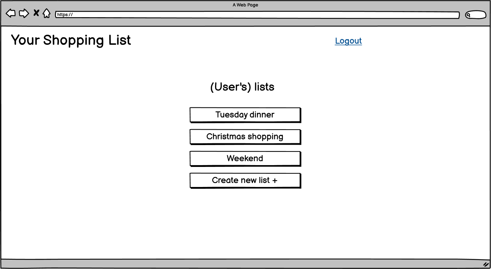

# Your Shopping List
*Your Shopping List* is the place to go if you want a quick and easy way to create a shopping list while on the go! You can: edit it, delete it or share it with a friend!

This is a project created during the Code Institute flag, being the portfolio project 4. It is for learning purposes only.

Link to live site
Picture of responsiveness

## Contents

* [User Experience](#user-experience)
    * [Colour Scheme](#colour-scheme)
    * [Font](#Font)
* [Project Planning](#project-planning)
    * [Agile Methods](#agile-methods)
    * [MoSCoW method](moscow-method)
    * [User Stories](#user-stories)
    * [Wireframes](#wireframes)
    * [ERDs](#erds)
* [Features](#features)
    * [CRUD functionality](#crud-functionality)
    * [Showcase](#showcase)
    * [Future Features](#future-features)
* [Technologies and Languages used](#technologies-and-languages-used)
* [Testing](#testing)
* [Deployment](#deployment)
    * [Guthub](#github)
    * [Django](#Django)
    * [Heroku](#heroku)
    * [CI Database](#CI-database)
    * [Clone](#Clone)
    * [Fork](#fork)
* [Credits](#credits)
    * [Code](#code)
    * [Acknowledgements](#acknowledgements)

## User Experience
This application needs to be fast to use. It is competing with your phones notes app, a piece of paper and a pen and of course just your memory.

The USP of this site is to have a clean look which gives the user a clear oversite and easy to use features you can not find at it's competitors.
### Colour Scheme
The colours chosen for this site are contrasting eachother and each serves their own purpose.

- Off-white / #ECE5DC: used as a general background colour
- Ocean blue / #2DAFD6: used as the background colour of the navigation bar
- Notebook yellow / #EED878: used as the background of the lists and the landing page information. Chosen to imitate the colour of a notebook.
- Teal / #008080: used for the lines in the notebook imitation.

### Font
The font used is *Roboto*. It is a clean, sans-serif font which fits perfect for a website with a simple design. The font is imported from Google Fonts.

## Project Planning
This project is intended to help with the everyday life mission to go to the grocery store. With a working shopping list system you can make your shopping more efficient and be sure to come back home with the items you needed. With a sharing feature a partner, friend or family member can do the shopping the site user planned and in that way be of service in sickness and in health.

**Site Goals**
* Provide a quick way to write and handle shopping lists
* Have a nice look with good responsiveness
* Have easy to use features, especially on mobile
* Have a quick and secure way of sharing lists

### Agile Methods
This project was planned with agile methods. As some features depended on others to be built, the obvious way was to start with the most fundamental features and user stories first and work upwards. Since one feature had the label "Could have" it was planned to be built last, after the site was fully functioning.

### MoSCoW Method
The issues created for this site were labeled with the use of the MoSCoW method. That divides the labels into:

* Must have - features that is a must for the site to be working as intended
* Should have - features that the site should have to be of use to the user
* Could have - features that could bring that little extra to the user
* Won't have - features that no longer fit the project or won't be included in this release

### User Stories
|User Story|Priority|
|-|-|
|As a user I can create an account so that I can sign in to the application.|MUST HAVE|
|As a user I can log in to my account so that I can see, edit and delete my lists|MUST HAVE|
|As a user I can log out of my account so that me or someone else can log in to another account on the same device|MUST HAVE|
|As a user I can create a shopping list so that I have a place to write what groceries to buy.|SHOULD HAVE|
|As a user I can edit a list I created before so that I can reuse older lists or change a list I intended to use.|SHOULD HAVE|
|As a user I can delete a list so that I don’t have to see it in my list menu|SHOULD HAVE|
|As a user I can share a list so that other people can shop from a list I have created.|COULD HAVE|
|As an admin I can delete users so that inactive users don’t take up space in the database|SHOULD HAVE|

### Wireframes
The site was developed mobile first. The desktop wireframes are therefor bigger versions of the mobile wireframes.

**Mobile**

**Desktop**

### ERDs
This site uses three models: Django's *User* model, a *list* model and a *list item* model. 

Below is the Entity Relationship Diagram:

**User**
Django's User model is a excellent way to create and handle users at your site. Combined with the AllAuth framework, a lot of the work to create a functioning site with user is already done. 

The default fields for the AllAuth sign up page is *username*, *email* and *password.* To differentiate between regular users and admin accounts the *Superuser* field was added to the ERD. These are not all of the Django User model fields, but those used in this site.

**List**
The List model is a custom model. It has a primary key of Djangos default id field, that increments automatically. That id is also what builds the detailed list views URL. The author field is a foreign key that connects with the user model. It is mostly used for authentification.

**List item**
The List item model is what creates what you actually see in the lists. It also has a primary key of the default id field. It also connects to the user model via the author field. The List model has a second foreign key connecting it to the List model. This is to make sure that the correct items are displayed when opening a list.

## Features
### CRUD functionality
This site contains three different kind of objects: User, List and List item.

As a logged in user you can handle List and List items. With simple buttons and forms you can create, read, update and delete your lists and list items.

As a not logged in user you are only allowed to create a user. Remaining handling features of the user object is limited to the superusers through the admin page. As of now there is no way for a regular user to update username, change password or delete account.

### Feature showcase
#### Navbar
The Navbar is simple. An only text logo and links to Sign Up, Login and (when logged in) Logout.

#### Sign Up / Login / Logout
The Sign Up, Login and Logout pages all inherits the navbar from the rest of the site. Their own design comes mostly from the AllAuth framework.

#### Home page
The home page is what a non logged in user sees when entering the site. Back end wise this is the same page as the List menu.

A short text quickly explains to the user what the site can do and why it is useful.

#### List menu
The list menu displays the user's lists with a notebook like background. The name of the appears to be on one of the lines in the notebook. At the bottom of the menu the user finds the "Create New List"-button. That opens a modal in which the user can submit a name to the list.

#### List
In the detailed list view is where the real work of the site takes place. This is where the user creates the content of the list. The page also allows the user to edit the list, delete the list and via email share the list.

The *EDIT* and *EDIT LIST* buttons allows the user to edit the list name respectively the list items.

To share and delete the list - modals pop up and the user can enter the information needed and/or confirm the action.

#### Error pages
If an error were to appear, the site has a 404 / 403 / 500 page ready to go. For consistency they all look the same with slight differences in the displayed message and error code. A link takes the user back to the home page.

#### Admin page
The site uses the Django Admin page. From there a superuser can use CRUD functionality on all of the sites objects.

### Future features
There are a lot of features that were considered for this site that would make it a lot better. Time has, as always, been a factor in the development and it wasn't sufficient to create and implement these features.

#### Checkbox
For a long time during the development, a checked field was part of the List item model. The idea was to allow the user to check a checkbox when an item had been bought / put in the basket when at the store. That data would then be stored until the next time the list were opened. 

Lack of understanding how to connect the input checkbox element with the checked field in the model put the feature on hold for now.

#### Visual examples in home page

To give a new user a better picture of how the site looks and works, images or real examples of the list menu and detailed list could be displayed on the home page.

#### Improved email feature
As of now, the email feature gives the receiver the name of the list, the list items and a custom message. Ideally the receiver would also get the notebook look that is associated with the site, in the email. The chosen email service, EmailJS, seems to lack that feature as of now.

#### A shop price scanner
A feature that would really take the site to the next level would be the shop price scanner. The idea would be that the user inserts a list item (for example "Granny Smith apples") and the site scans the local grocery stores and suggests a store to visit depending on that stores price of the specific item. This would of course require an item library and a function to scan stores websites.

#### Link to admin page
To make it easier for a Superuser to navigate to the admin page, a link to the page could be added to the navbar or to a footer. For now the superuser needs to add /admin to the home page URL.

## Technologies used
- **HTML5**, used to create the structure of the site
- **CSS**, used to add custom styling
- **Javascript**, used to add interactivity
- **Python**, used to provide functionality
- **Django**, framework used to create the backend shell of the site
- **Bootstrap**, used for easy styling
- **CI Database**, used for data storage
- **Lucidchart**, used for creating ERDs
- **Balsamiq**, used for creating wireframes
- **Am I responsive?**, used for responsiveness imagery
- **Coolors**, used for creating colour pallette
- **Gitpod**, used for writing code in
- **Github**, used for storing code in 
- **Heroku**, used for deployment

## Testing
Testing of the site can be found [here](TESTING.md).

## Deployment
### Creating the Django App
This is how this Django App was created:
1. [This](https://github.com/Code-Institute-Org/gitpod-full-template) Code Institute template was used
2. When own repository had been created, a Gitpod workspace was created
3. Django was installed: `pip3 install django gunicorn` 
4. Install supporting database libraries: `pip3 install dj_database_url psycopg2`
5. Create requirements file: `pip freeze --local > requirements.txt`
6. Create project: `django-admin startproject project_name`
7. Create app: `python3 manage.py startapp app_name` 
8. Add app to INSTALLED_APPS[] in project_name > settings
9. Migrate changes: `python3 manage.py migrate`

The app should now be working. Test it with command `python3 manage.py runserver`

### Deploying on Heroku
This app was deployed using Heroku.
1. Create an account and / or login to Heroku.
2. Click "New" and "Create new app"
3. Choose a name and a region
4. If not last deployment, add DISABLE_COLLECTSTATIC = 1 to config vars in settings
5. Add your DATABASE_URL (if any) and SECRET_KEY to config vars
6. In deployment, connect Heroku App to you Github repository
7. Deploy through automatic or manual deployment

### How to fork
These are instructions how to fork the app from Github:

1. Sign in / create an account at [Github](https://www.github.com)
2. Go to the application's repository [*your-shopping-list*](https://github.com/mikael-johnsson/your-shopping-list)
3. Click "Fork" > "Create a new fork"
4. Choose an appropriate name and click "Create Fork"

### How to clone
These are instructions how to fork the app from Github:

1. Sign in / create an account at [Github](https://www.github.com)
2. Go to the application's repository [*your-shopping-list*](https://github.com/mikael-johnsson/your-shopping-list)
3. Click "Code"
4. Choose to clone via HTTPS, SSH-key or Github CLI
5. Go to IDE of choice, I chose Gitpod
6. Create workspace via chosen clone way from step 4

## Credits
### Credits
The log in/log out/sign up code is from Django AllAuth library and inplemented as it was in the Code Institute Blog Walkthrough.

The notebook look is from [here](https://www.codesdope.com/blog/article/getting-notebook-paper-effect-with-css/).
### Acknowledgments
A big thank you to my mentor Graeme Taylor for inspiration and encouragement.