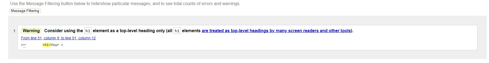
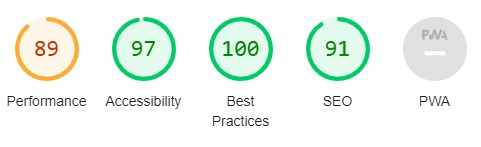
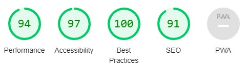
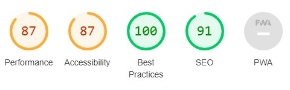
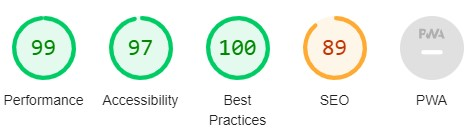
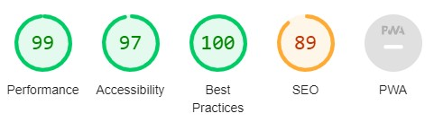
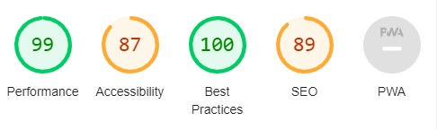

# Testing for *Your Shopping List*

This is the testing for the site *Your Shopping List*.

Link to live site [here](https://your-shopping-list-mj-f192e4c3538e.herokuapp.com/)
Find the README [here](README.md).
## User Story testing

|User Story|Outcome|
|-|-|
|As a user I can create an account so that I can sign in to the application.|A non logged in user can click the Sign Up link in the navbar and create an account|
|As a user I can log in to my account so that I can see, edit and delete my lists|A non logged in user with an account can log in to the account using the Login link in the navbar|
|As a user I can log out of my account so that me or someone else can log in to another account on the same device|A logged in user can logout using the logout link. The user or someone else can then log in to another account on that device|
|As a user I can create a shopping list so that I have a place to write what groceries to buy.|A logged in user can create a list by clicking the Create New List button displayed on the list menu page|
|As a user I can edit a list I created before so that I can reuse older lists or change a list I intended to use.|A logged in user with a created list can edit the list by navigating to the list and adding, editing and deleting items in the list. They can also edit the list name|
|As a user I can delete a list so that I don’t have to see it in my list menu|A logged in user with a created list can delete the list by first clicking the Delete List button and then confirm the deletion in the modal that pops up.|
|As a user I can share a list so that other people can shop from a list I have created.|A logged in user with a created list can email the list to whomever they like by first clicking the Share List button, filling in the form in the modal that pops up and then click the Send List button|
|As an admin I can delete users so that inactive users don’t take up space in the database|A Superuser can go to the admin page, log in and edit and delete users|

## Automated Testing
### W3C HTML
All of this sites html pages have been validated through W3C validator. It came back with one warning: it suggests the logo in the navbar should not be an h1 element. As a minor warning I have chosen to disregard it.

### W3C CSS
This project has one CSS file. It went through the W3C CSS validator and came back with no warnings or errors.
### JSHint
This project has on javascript file. It went through JSHint and came back with some warnings.
- It warns that the bootstrap variable is undefined
- It warns that the emailjs variable is undefined
- It warns that the sendMail variable is unused

The bootstrap and emailjs variable are important to the functionality of the site and exist due to instructions from bootstrap respective emailjs. I will disregard these warnings due to eventual errors to functionality.

sendMail is a function written properly, why this is caught by JSHint I do not know. I will disregard this warning.
### CI Python Linter
Code Instittue has a easy to use Python Linter. You can find it [here](https://pep8ci.herokuapp.com/).

All of the python files were processed through the CI Python Linter. It came back with no errors.

### Lighthouse
Lighthouse is a devtools tool to measure performance, accessibility, best practices and SEO of a site. It rates between 0 and 100. These are the results of this site:

**Mobile, home page**

**Mobile, list menu page**

**Mobile, list page**

**Desktop, home page**

**Desktop, list menu page**

**Desktop, list page**

With a few 100s in the top and a few 87 as a lowest, the average value is 94.5. I deem it acceptable with some work to be done with the accessibility of the site.

## Manual Testing
**Feature testing**

|Feature|Expected outcome|Test performed|Result|
|-|-|-|-|
|*When not logged in*||||
|Navbar - *SIGN UP*|Redirect to Sign Up page|Clicked|As expected|
|Navbar - *LOGIN*|Redirect to Login page|Clicked|As expected|
|Sign Up page - sign in link|Redirect to Login page|Clicked|As expected|
|Sign up page - sign up button|Redirect to List menu (if entered correct input)|Clicked|As expected|
|Login page - sign up link|Redirect to Sign Up page|Clicked|As expected|
|Login page - login button|Redirect to List menu page (if correct account details entered)|Clicked|As expected|
|*When logged in*||||
|List menu page - create new list modal|Create new list modal to pop up|Clicked|As expexted|
|List menu page - create new list|Modal to stop displaying and new list with chosen name is in list menu|Input a valid name and clicked Save new list|As expected|
|List menu page - list|Redirect to correct list|Clicked|As expexted|
|List menu page - logout|Redirect to logout page|Clicked|As expected|
|List page - edit list name|Hide edit button, display input field and Update button|Clicked|As expected|
|List page - update list name|List name to update|Enter a valid value and clicked Update button|As expected|
|List page - created on|Correct date and time of list creation showin|N/A|As expected|
|List page - edit list|Display Edit button and Delete button next to each item|Clicked Edit List button|As expected|
|List page - edit item|Hide Edit button and Delete button to the chosen item, display input field and Update button|Clicked Edit button|As expected|
|List page - update item|Item content to update|Entered a valid value and clicked update|As expected|
|List page - delete item|Item to be deleted|Clicked Delete button to the chosen item|As expected|
|List page - add item|Item to be added|Input a valid value and clicked add|As expected|
|List page - share list modal|Share list modal to pop up|Clicked Share|As expected|
|List page - share list|Send list (name, items) and message to chosen receiver|Input values in form, clicked Send list|As expected|
|List page - delete list modal|Delete list modal to pop up|Clicked Delete List|As expected|
|List page - delete list|List to be deleted, redirect to List menu|Confirm deletion|As expected|
|List page - Go back button|Redirect to List menu|Clicked|As expected|

**Input testing**
|Input field|Test|Outcome|Result|
|-|-|-|-|
|*Signup page*||||
|Username|only pressing enter|Error message shows|Valid|
|Username|only input blankspace|Okay|Invalid|
|Password|not following displayed password rules|Error message shows|Valid|
|*Login page*||||
|Username|only pressing enter|Error message shows|Valid|
|Password|only pressing enter|Error message shows|Valid|
|Password|entering incorrect password|Error message shows|Valid|
|*List menu page*||||
|Create new list modal|only pressing enter|Error message shows|Valid|
|Create new list modal|only entering blankspace|Error message shows, stop displaying modal|Valid|
|Create new list modal|entering name over 25 characters|Error message shows, stop displaying modal|Valid|
|*List page*||||
|Edit list name|only pressing enter|Error message shows|Valid|
|Edit list name|only entering blankspace|Error message shows|Valid|
|Edit list name|entering name over 25 characters|Error message shows|Valid|
|Edit item content|only pressing enter|Error message shows|Valid|
|Edit item content|only entering blankspace|Error message shows|Valid|
|Edit item content|entering value over 35 characters|Error message shows|Valid|
|*Share list modal*||||
|Name field|only pressing enter|Error message shows|Valid|
|Email field|only pressing enter|Error message shows|Valid|
|Email field|only entering blankspace|Error message shows|Valid|

As of now, it is possible to create a username consisting of only blankspaces. It is not ideal but a part of Djangos AllAuth library and the resources to remedy it are not sufficient.

**Messages**

Messages with the correct message shall appear between content and navbar after the following actions:

- Login
- Logout
- Created list
- Submitting a list name longer than 35 characters
- Submitting a list name with only blankspaces
- Updated list name
- Deleted list
- Updated item
- Added item
- Deleted item
- Submitting item content longer than 35 characters
- Submitting item content with only blankspaces

After meticulous testing, it is clear that the correct message appear after the correlating action.

## Bugs
### Fixed bugs
- CSS did not load properly. This was fixed after a conversation with a CI tutor, the problem was that debug was set to false (which can affect the ability to read CSS).
- Modal not showing. When implementing Bootstrap modals, they failed to show. This was fixed after a conversation with a CI tutor, the problem was that Bootstrap had changed the syntax of how to display a modal.

### Flaws
- Early on in development a mistake was made. Before the database URL had been moved to the env.py file (that is secret and not pushed to Github) the code was pushed to github. That is not ideal but deemed to be to big of a problem to handle during this time.

